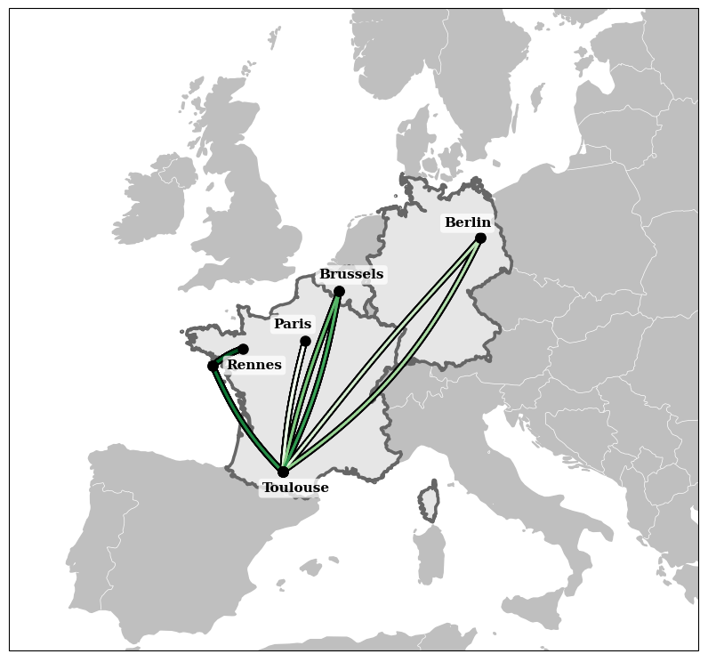

## Bio
I was born in 1997 in Paris. Since then, I moved around France and Europe during my studies, spending some time in Toulouse, Berlin, Brussels, and currently finishing my PhD in Rennes.
{: width="65%"}

## Experience
- **Oct. 2021 - Jan. 2025**: **CIFRE PhD** at **Groupe Créative, Inria** - *Rennes, France*\
In 2021, I joined [Groupe Créative](https://www.groupe-creative.fr/) and the Inria/IRISA [Rainbow team](https://team.inria.fr/rainbow/en/) to begin my PhD in the context of a CIFRE partnership. I worked on the topic of **Autonomous Exploration in Unknown 3D Environments**, focusing in particular on the planning and high-level decision aspects of exploration; I developped various planning methods and exploration strategies, deploying them in various simulated and real scenarios. The associated publications can be found under this site's [Publications](/publications/) page. *This PhD work is to be defended in early 2025.* 
- **Feb. 2021 - Oct. 2021**: **Pre-PhD engineering position** at **Inria** - *Rennes, France*
- **May  2020 - Oct. 2020**: **MSc research internship in robotics** at **LAAS-CNRS** - *Toulouse, France*\
During my internship in the [Gepetto team](https://www.laas.fr/en/teams/gepetto/) at LAAS, I worked on the SOLO quadruped robot to develop real-time self-collision avoidance methods. These methods were integrated in an on-board safety controller and [published to the ICRA 2021 conference](/publications/solo_self_collisions).
- **Mar. 2019 - Aug. 2019**: **Space-oriented R&D internship in robotics** at **Space Applications Services** - *Zaventem, Belgium*\
At [Space Applications Services](https://www.spaceapplications.com/), my internship was related to the [H2020 Pro-Act project](https://www.h2020-pro-act.eu/), the goal of which was to develop an analogue demonstration system for lunar collaborative manipulation, with the long-term objective of developing in-situ resources utilization (ISRU). My work was focused on the development of simulation environments for the project, including robots, sensors and lunar terrain models.
- **Sep. 2018 - Feb. 2019**: **Research internship in planetology** at **IRAP** - *Toulouse, France* \
My first research experience was my internship at [IRAP (Research Institute for Astrophysics and Planetology)](https://www.irap.omp.eu/) during which I worked on identifying characteristic orbital events from the sensors data of Mars orbiters; the goal was to explore the usage of data-driven classifiers to identify "shock crossings", i.e., transitions of the satellite between the solar wind and Mars atmosphere.

## Education
- **Sep. 2017 - Sep. 2020**: ISAE-Supaero engineering master student - *Toulouse, France*\
*Associative work*: Supaero Space Section - Mechanical design (Scalar 3, Scalar 4)\
*Specialization*: 
    - Earth Observation
    - Autonomous Systems - Robotics  
- **Mar. 2018 - Jul. 2018**: Erasmus semester at Technische Universität Berlin - *Berlin, Germany*\
*Courses*: Satellite design techniques, Spaceflight physiology and psychology, Spaceflight planification and exploitation, [Project course] Space robotics: SEAR rover simulation
- **Sep. 2015 - Jul. 2017**: CPGE *(Preparatory classes for French engineering schools)* - *St-Maur-des-Fossés, France*
